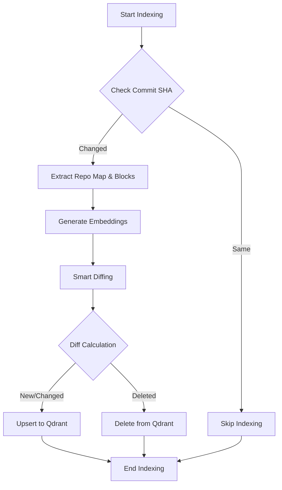
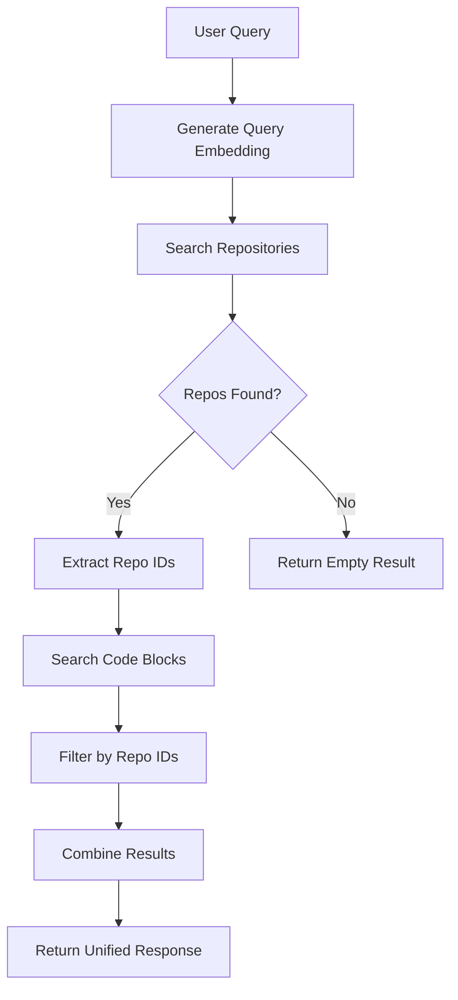

# RAG 파이프라인 상세 기술 문서

본 문서는 RepoMapper의 RAG(Retrieval-Augmented Generation) 시스템의 핵심인 **저장(Indexing)**과 **검색(Search)** 프로세스에 대한 상세 기술 명세입니다.

## 1. 저장 (Indexing) 프로세스

저장 프로세스는 소스 코드를 분석하여 임베딩 벡터로 변환하고, Qdrant 벡터 데이터베이스에 저장하는 과정입니다. 효율성을 위해 **증분 인덱싱(Incremental Indexing)**과 **Smart Diffing** 전략을 사용합니다.

### 1.1 핵심 컴포넌트
- **RepositoryManager**: 파일 시스템 스캔, Git 정보 추출, 캐시 관리 (`diskcache`).
- **RepoSummaryGenerator**: LLM을 사용하여 리포지토리 전체 요약 생성.
- **Embedder**: 텍스트(코드/요약)를 벡터로 변환 (`all-MiniLM-L6-v2`, 384차원).
- **RepoIndexer**: Qdrant DB와의 통신 및 데이터 동기화 관리.

### 1.2 상세 워크플로우

#### Step 1: 변경 감지 (Commit SHA Check)
1.  클라이언트가 `/index` API를 호출합니다.
2.  **현재 Commit SHA 추출**: `git rev-parse HEAD`를 통해 현재 리포지토리의 버전을 확인합니다.
3.  **마지막 인덱싱 버전 확인**: Qdrant의 `repositories` 컬렉션에서 해당 리포지토리의 `commit_sha`를 조회합니다.
4.  **Skip 결정**: 현재 SHA와 마지막 SHA가 일치하면, 변경사항이 없는 것으로 간주하고 인덱싱을 건너뜁니다. (불필요한 연산 방지)

#### Step 2: 데이터 추출 및 캐싱 (Local Caching)
1.  **Repo Map 생성**: 전체 프로젝트 구조를 트리 형태로 시각화한 텍스트를 생성합니다.
    -   `diskcache`를 사용하여 파일의 `mtime`(수정 시간)이 변경되지 않았다면 파싱 과정을 생략하고 캐시된 데이터를 사용합니다.
2.  **Semantic Block 추출**: 소스 코드를 함수/클래스 단위의 의미 있는 블록으로 분할합니다.
    -   마찬가지로 `mtime` 기반 캐싱을 통해 변경되지 않은 파일은 파싱하지 않습니다.

#### Step 3: 임베딩 (Embedding)
1.  **요약 임베딩**: 생성된 리포지토리 요약문을 `Embedder`를 통해 384차원 벡터로 변환합니다.
2.  **블록 임베딩**: 추출된 각 코드 블록의 내용(`content`)을 벡터로 변환합니다.

### 1.3 Indexing Workflow Diagram

#### Step 4: Smart Diffing 및 저장 (Qdrant Sync)
Qdrant에 데이터를 저장할 때, 무조건 삭제 후 다시 넣는 비효율을 막기 위해 **Smart Diffing** 로직을 수행합니다.

1.  **Repository Info Upsert**: 리포지토리 요약 정보와 Commit SHA는 항상 최신으로 덮어씁니다 (`Upsert`).
2.  **Block ID 조회**: Qdrant에서 해당 리포지토리의 **모든 기존 블록 ID**를 가져옵니다.
3.  **ID 생성**: 현재 추출된 블록들의 ID를 생성합니다. (ID는 `repo_id:file_path:name:start_line` 조합의 해시값으로 결정적입니다.)
4.  **Diff 계산**:
    -   `To Delete` = (기존 ID 집합) - (현재 ID 집합)
    -   `To Upsert` = (현재 ID 집합)
5.  **삭제 (Delete)**: `To Delete`에 해당하는 블록(삭제된 코드, 변경되어 ID가 바뀐 코드)을 Qdrant에서 **즉시 삭제**합니다. 이를 통해 검색 결과에 더 이상 존재하지 않는 코드가 나오는 것을 방지합니다.
6.  **업데이트 (Upsert)**: `To Upsert`에 해당하는 블록들을 Qdrant에 저장/갱신합니다.

---

## 2. 검색 (Search) 프로세스

검색 프로세스는 사용자의 자연어 쿼리를 벡터로 변환하여, 가장 관련성 높은 리포지토리와 코드 블록을 찾아내는 과정입니다.

### 2.1 검색 API 구조
- **/search/repos**: 리포지토리 단위 검색.
- **/search/code**: 코드 블록 단위 검색 (특정 리포지토리 필터링 가능).
- **/search/unified**: 통합 검색 (한 번의 임베딩으로 리포지토리와 코드를 모두 검색).

### 2.2 상세 워크플로우 (Unified Search 기준)

#### Step 1: 쿼리 임베딩 (Query Embedding)
1.  사용자가 입력한 자연어 쿼리(예: "로그인 인증 로직")를 받습니다.
2.  `Embedder`를 사용하여 쿼리를 384차원 벡터로 변환합니다. (이 과정은 요청당 **단 한 번**만 수행됩니다.)

#### Step 2: 리포지토리 검색 (Repo Search)
1.  생성된 쿼리 벡터를 사용하여 Qdrant의 `repositories` 컬렉션을 검색합니다 (`query_points`).
2.  코사인 유사도(Cosine Similarity)가 높은 상위 N개(기본 5개)의 리포지토리를 추출합니다.
3.  결과: `[Repo A (score: 0.9), Repo B (score: 0.8)]`

#### Step 3: 코드 블록 검색 (Code Block Search with Filtering)
1.  앞서 찾은 리포지토리들의 ID 리스트(`[Repo A, Repo B]`)를 추출합니다.
2.  **필터링 검색**: `code_blocks` 컬렉션에서 검색을 수행하되, `repo_id`가 위 리스트에 포함된 블록들만 대상으로 하도록 **필터(Filter)**를 겁니다.
    -   이렇게 하면 관련 없는 리포지토리의 코드가 검색되는 것을 방지하고, 검색 속도를 높일 수 있습니다.
3.  쿼리 벡터와 가장 유사한 상위 M개(기본 10개)의 코드 블록을 추출합니다.

#### Step 4: 결과 통합 및 반환
1.  리포지토리 검색 결과와 코드 블록 검색 결과를 하나의 JSON 응답(`UnifiedSearchResponse`)으로 결합하여 클라이언트에 반환합니다.

## 3. 데이터베이스 스키마 (Qdrant)

### Collection: `repositories`
- **Vector**: 384차원 (`all-MiniLM-L6-v2`)
- **Payload**:
    - `repo_id`: 리포지토리 식별자 (예: `user/repo`)
    - `summary`: 리포지토리 요약문
    - `commit_sha`: 마지막 인덱싱 시점의 Commit SHA

### Collection: `code_blocks`
- **Vector**: 384차원
- **Payload**:
    - `repo_id`: 소속 리포지토리 ID
    - `file_path`: 파일 경로
    - `name`: 함수 또는 클래스 이름
    - `type`: 블록 타입 (`function`, `class` 등)
    - `content`: 코드 원문
    - `start_line`, `end_line`: 라인 정보
